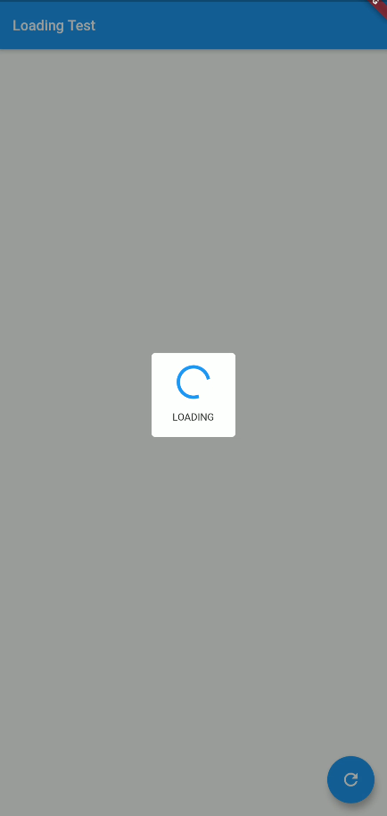

# loading_loading

Simple loading to your project.



## pubspec.yaml
```yaml
loading_loading: <last_version>
```

## main.dart
In main.dart file, add in `home` parameter the widget `LoadingWidget`, according example: 
```dart
MaterialApp(
  title: 'Flutter Demo',
  theme: ThemeData(
    primarySwatch: Colors.blue,
  ),
  home: LoadingWidget(child: HomePage()),
);
```

## Change loading status
This package have a two functions to change a loading:
```dart
void LoadingWidget.toggle(); //To toggle a loading status
void LoadingWidget.setLoading(bool status); //To set a loading status
```

## Verify loading
To verify the loading status, look at this property:
```dart
bool LoadingWidget.isLoading;
```

## Custom loading widget
To use a custom loading widget, add a `loading` parameter, according example:
```dart
LoadingWidget(
  child: HomePage(),
```
```dart
  loading: Container(
    alignment: Alignment.center,
    color: Colors.black38,
    child: Container(
      width: 100,
      height: 100,
      alignment: Alignment.center,
      decoration: BoxDecoration(
        color: Colors.white,
        borderRadius: BorderRadius.circular(5),
      ),
      child: CircularProgressIndicator(),
    ),
  ),
```
```dart
);
```

## Getting Started

This project is a starting point for a Dart
[package](https://flutter.dev/developing-packages/),
a library module containing code that can be shared easily across
multiple Flutter or Dart projects.

For help getting started with Flutter, view our 
[online documentation](https://flutter.dev/docs), which offers tutorials, 
samples, guidance on mobile development, and a full API reference.
